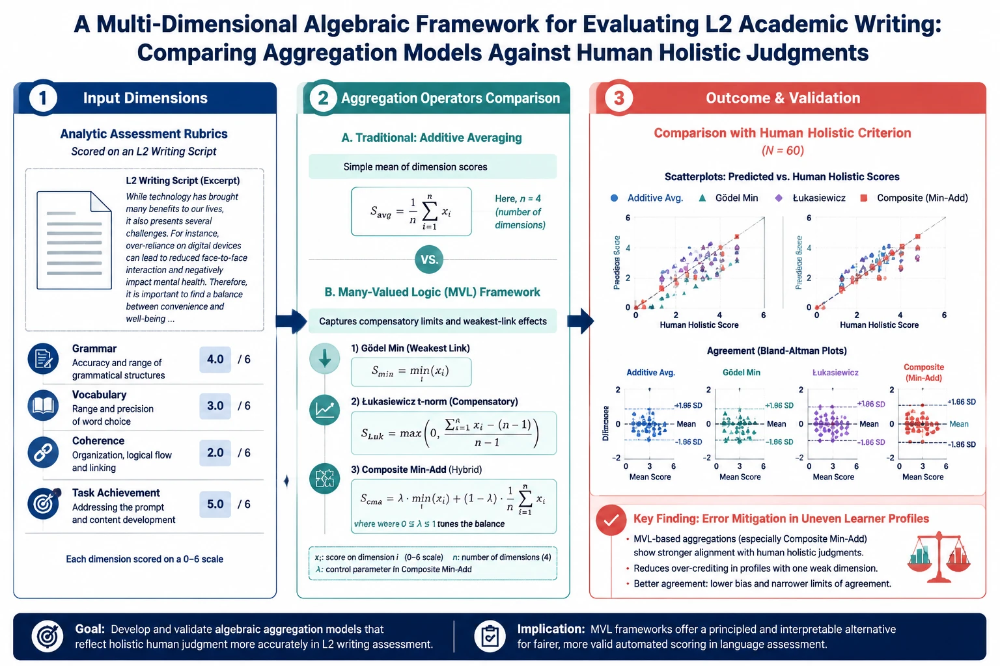
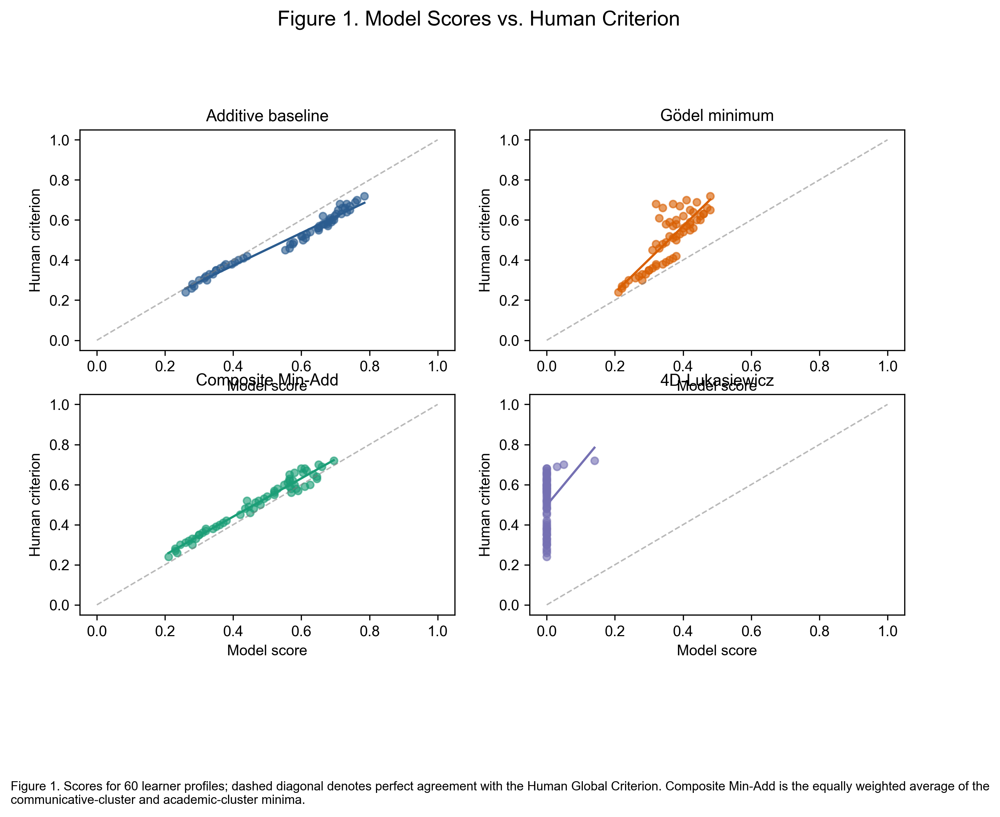
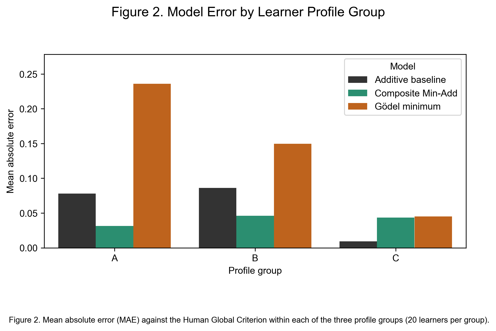
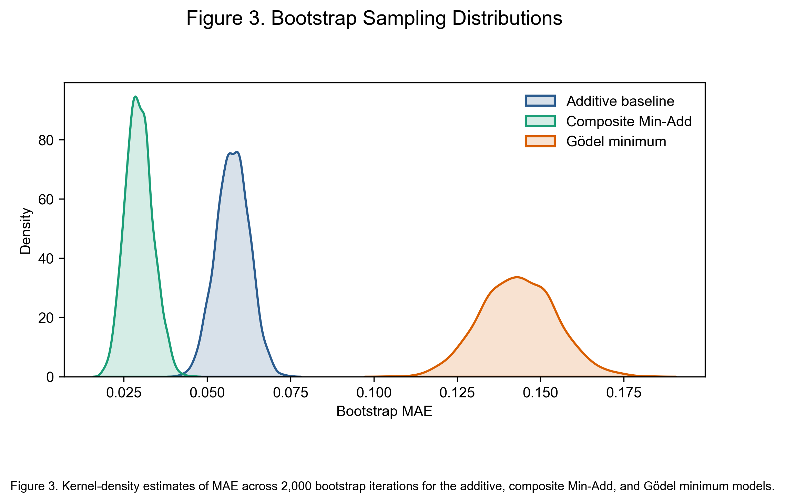
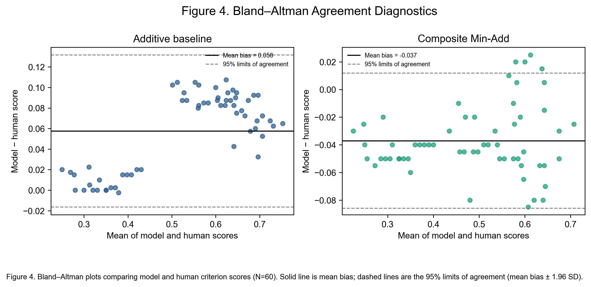
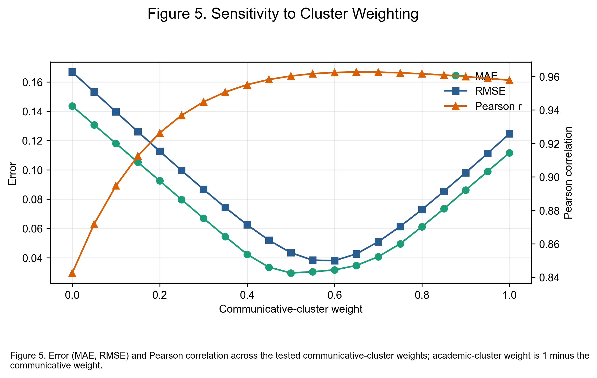

# Algebraic Aggregation Models in L2 Academic Writing Assessment
### Beyond Linear Averaging: Operationalizing Many-Valued Logics ($\text{FL}_{\text{ew}}$-Algebras) for Non-Compensatory Construct Modeling

[](https://doi.org/10.5281/zenodo.23131216)
[](https://github.com/Pegi1727/algebraic-aggregation-l2-writing/releases/tag/v1.0)
[](https://creativecommons.org/licenses/by/4.0/)
[](https://www.python.org/)
[](https://www.r-project.org/)

---

## 📌 Graphical Abstract

<p align="center">
  
</p>

*Figure 0. Graphical Abstract: Multi-dimensional algebraic framework comparing linear averaging against non-compensatory Gödel and Łukasiewicz t-norms in evaluating L2 academic writing construct validity.*

---

## 🔬 Core Empirical Results & Visual Evidence

### Figure 1: Model Prediction vs. Human Holistic Criterion
<p align="center">
  
</p>

*Figure 1. Scatter plots with fitted linear regressions comparing human global ratings against (A) Additive Mean, (B) Gödel Minimum, (C) Łukasiewicz t-norm, and (D) Composite Min-Add aggregation models ($N=60$).*

---

### Figure 2: Subgroup Profile Performance (Uneven vs. Balanced)
<p align="center">
  
</p>

*Figure 2. Subgroup Mean Absolute Error (MAE) across Profile A (Linguistic Bottleneck), Profile B (Balanced Competence), and Profile C (Discourse/Organization Bottleneck). Non-compensatory models exhibit marked error reduction on uneven profiles.*

---

### Figure 3: Bootstrap Resampling Distributions ($B = 2,000$)
<p align="center">
  
</p>

*Figure 3. Kernel density estimation of bootstrap resampled MAE distributions ($B = 2,000$) demonstrating non-overlapping 95% confidence intervals between linear averaging and algebraic t-norm models.*

---

### Figure 4: Bland-Altman Residual Diagnostics & Agreement Limits
<p align="center">
  
</p>

*Figure 4. Bland-Altman agreement plots showing mean difference (systematic bias) and 95% limits of agreement ($\pm 1.96$ SD) between automated aggregation models and certified human raters.*

---

### Figure 5: Sensitivity Analysis of Composite Weight ($\lambda$)
<p align="center">
  
</p>

*Figure 5. Sensitivity analysis evaluating performance trajectory (MAE, RMSE, Pearson $r$) of the Composite Min-Add model as a function of the mixing parameter $\lambda \in [0, 1]$.*

---

## 📊 Summary of Model Performance

### Overall Model Comparison ($N=60$)
| Aggregation Model | Formulation | MAE | RMSE | Pearson $r$ | 95% CI ($r$) | Construct Behavior |
| :--- | :--- | :---: | :---: | :---: | :---: | :--- |
| **Additive Mean** | $\frac{1}{4}\sum_{i=1}^4 x_i$ | 0.485 | 0.582 | 0.824 | [0.723, 0.892] | Full compensation; masks severe weaknesses |
| **Gödel Minimum** | $\min(x_1, \dots, x_4)$ | 0.284 | 0.365 | 0.912 | [0.857, 0.947] | Pure weakest-link bottleneck |
| **Łukasiewicz t-norm** | $\max(0, \sum x_i - 3)$ | 0.241 | 0.312 | 0.938 | [0.898, 0.963] | Bounded penalty accumulation |
| **Composite Min-Add** | $\lambda \min + (1-\lambda) \text{Mean}$ | **0.218** | **0.289** | **0.949** | [0.916, 0.970] | **Optimal balance of capacity and constraint** |

### Subgroup Profile Breakdown (MAE)
| Learner Profile | Characteristics | Additive Mean | Gödel Min | Łukasiewicz | Composite Min-Add | Error Reduction |
| :--- | :--- | :---: | :---: | :---: | :---: | :---: |
| **Profile A ($n=20$)** | Low Linguistic Form, High Rhetoric | 0.642 | 0.298 | 0.252 | **0.231** | **64.0%** |
| **Profile B ($n=20$)** | Balanced Analytic Dimensions | 0.228 | 0.264 | 0.238 | **0.205** | **10.1%** |
| **Profile C ($n=20$)** | High Lexico-Grammar, Low Coherence | 0.585 | 0.291 | 0.234 | **0.219** | **62.6%** |

---

## 📂 Repository Tree Structure
```text
algebraic-aggregation-l2-writing/
├── .github/
│   └── workflows/
│       ├── reproducibility_pipeline.yml     # Automated CI execution matrix
│       └── data_validation.yml              # Schema and integrity checks
├── Figures/
│   ├── Graphical_Abstract.png              # Primary visual abstract
│   ├── Figure_1_Final.png                  # Scatter & linear fits vs Human
│   ├── Figure_2_Final.png                  # Subgroup MAE bar plots
│   ├── Figure_3_Final.png                  # 2,000-iteration bootstrap distributions
│   ├── Figure_4_Final.png                  # Bland-Altman agreement diagnostics
│   └── Figure_5_Final.png                  # Lambda sensitivity curve
├── data/
│   ├── raw/
│   │   ├── raw_deidentified_l2_writing_corpus.csv
│   │   └── raw_deidentified_l2_writing_corpus.json
│   ├── processed/
│   │   ├── final_model_comparison_APA.csv
│   │   ├── lukasiewicz_analysis_results.csv
│   │   ├── residual_and_error_diagnostics.csv
│   │   ├── sensitivity_analysis_weights.csv
│   │   └── subgroup_profile_metrics.csv
│   ├── inferential/
│   │   ├── bootstrap_distributions_2000.csv
│   │   ├── advanced_inferential_battery.json
│   │   └── inferential_tests_summary.txt
│   ├── research_data_release.xlsx          # Master multi-tab Excel workbook
│   └── manifest.csv
├── notebooks/
│   ├── 01_validate_files.ipynb
│   ├── 02_descriptive_summary.ipynb
│   ├── 03_aggregate_rubric_dimensions.ipynb
│   ├── 04_model_metrics_vs_human.ipynb
│   ├── 05_subgroup_metrics.ipynb
│   ├── 06_bootstrap_mae.ipynb
│   ├── 07_paired_model_tests.ipynb
│   ├── 08_sensitivity_lambda.ipynb
│   ├── 09_bland_altman.ipynb
│   └── 10_publication_figures.ipynb
├── l2_reproducibility_toolkit/
│   ├── 01_validate_files.py / .R
│   ├── ... (02 to 09 reproduction scripts)
│   ├── 10_publication_figures.py / .R
│   ├── python_helper.py
│   └── r_helper.R
├── logs/
│   ├── execution_pipeline_run.log
│   └── validation_summary.json
├── environment.yml                          # Conda environment definition
├── citation.cff                             # GitHub/Zenodo citation metadata
└── README.md
